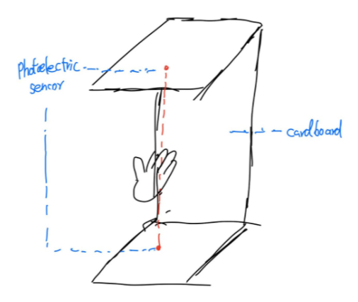
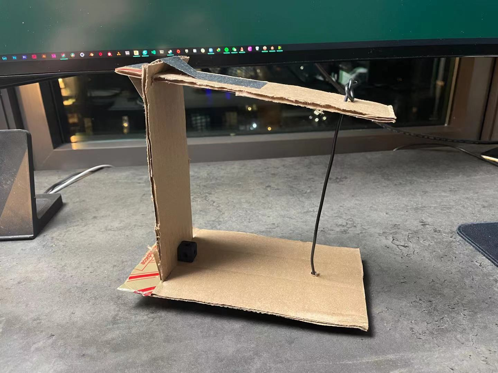
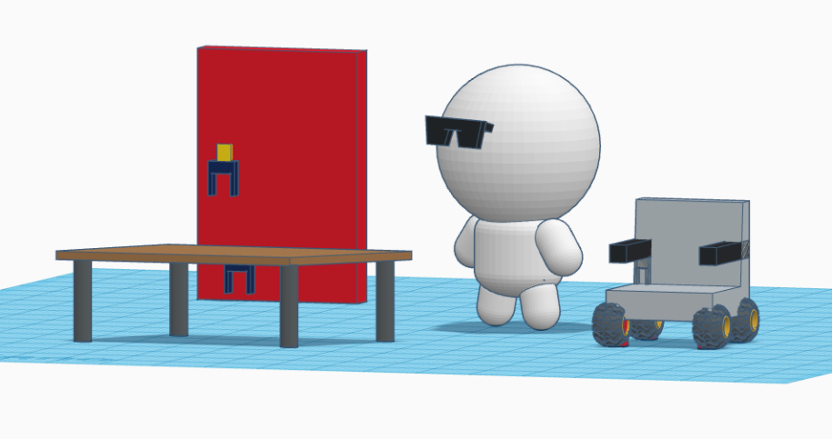
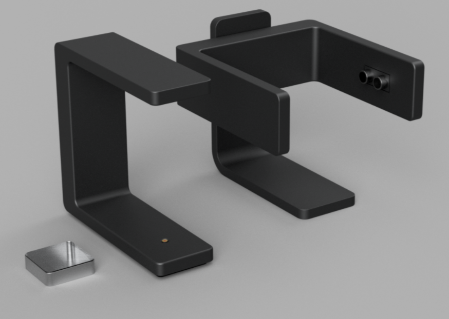
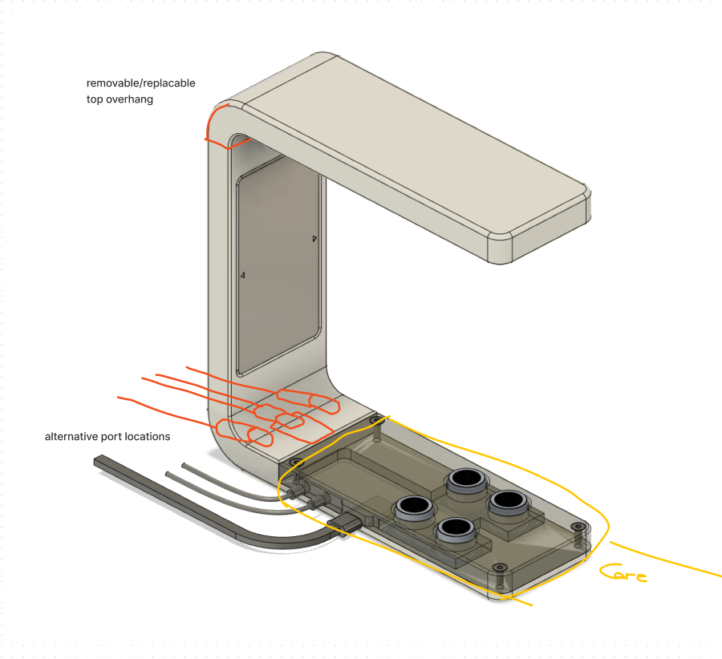
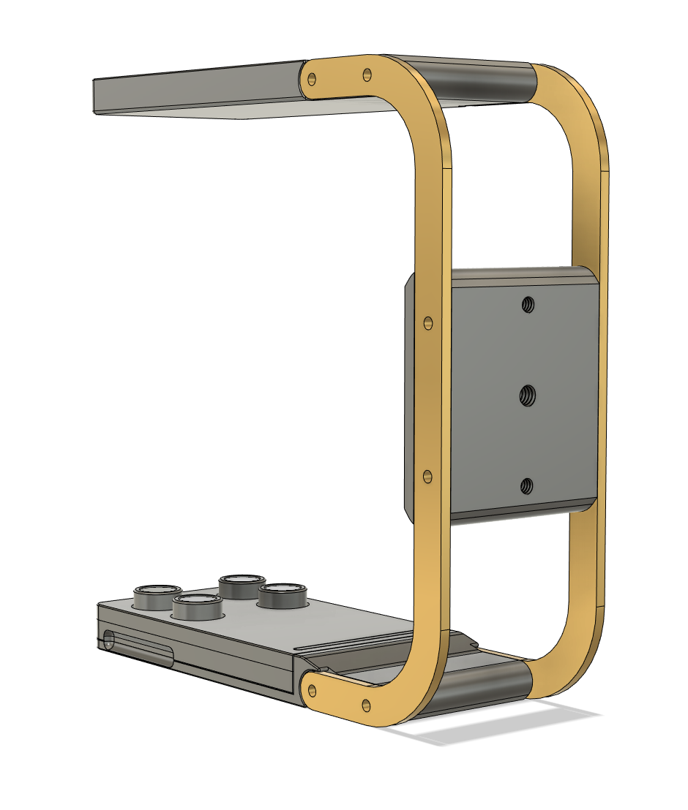
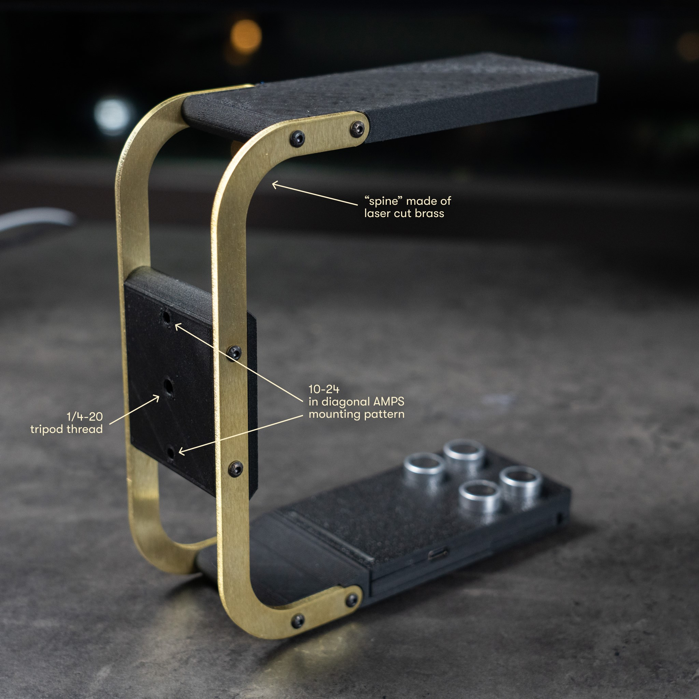
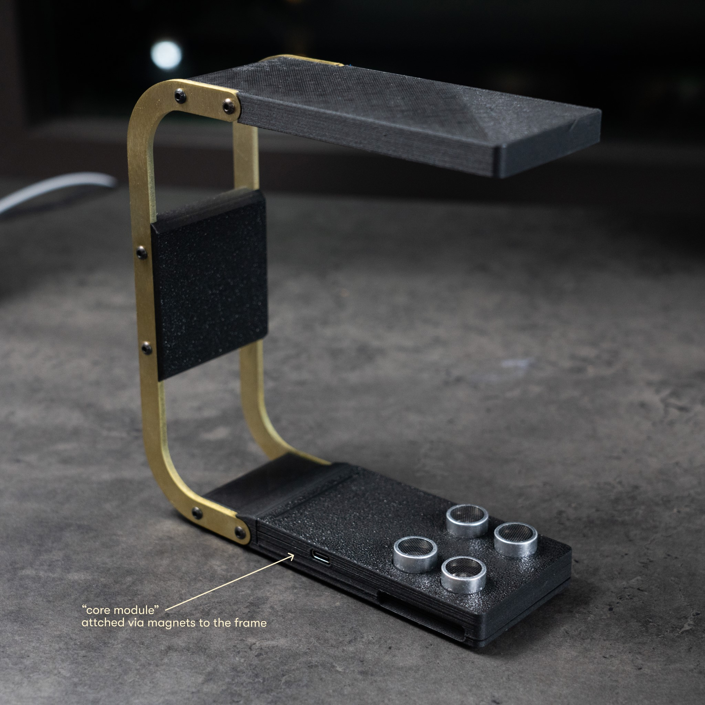
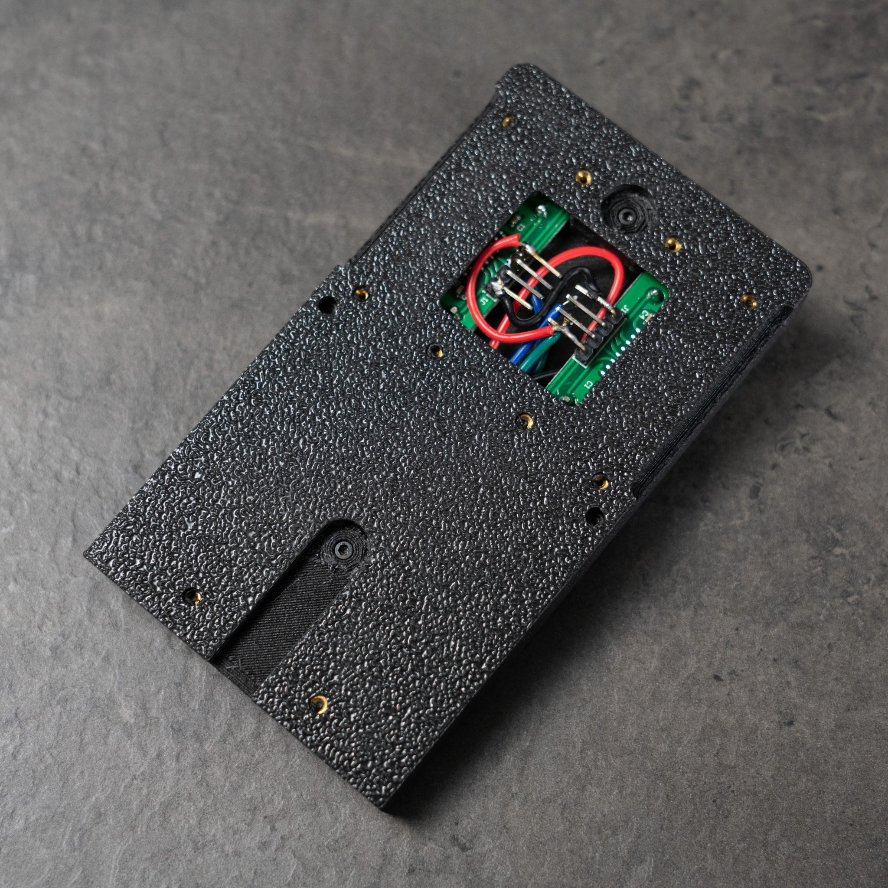
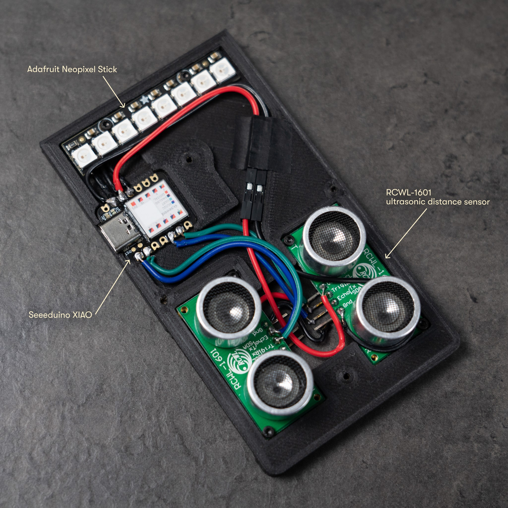

Wave hands and...

.jpg)

### TL;DR

A contactless gesture switch with bi-directional detection, U-shaped frame designed with affordance in mind, and flexibility in usage and mounting options.

### A brief timeline

- Week 3 - In-class ideation
  - After looking at all the abhorrently expensive AbleNet switches, we landed our focus on their selection of [proximity activated sensor switches](https://www.ablenetinc.com/switches/proximity-sensor-activation/) and decided to create our switch based on the same contactless principle.
  - Part of the reason was also the pertinence of a contactless switch amidst the current ongoing global pandemic where touching things aren’t really preferable.
  - We made a sketch and a cardboard prototype, which, retrospectively, has a surprising resemblance to the final product.

- Week 4 - Research

  - With the idea roughly settled down, we took a further look at the AbleNet solutions and found a couple of ways that we could potentially improve:

    - 10mm activation distance: given its nature as a “proximity” switch, the AbleNet Mini Beamer only triggers when an object is within 10 millimeters of its top surface. With some rudimentary conceptualization of how it works with a human hand, we think this wouldn’t be ideal if the aim is to avoid contact.

    - Placement: despite the compact form factor of the Mini Beamer, it’s design seemingly largely confines the device to sitting on top of a flat surface.

    - Price: it’s $145......

      

  - Additionally we had a first look at sensor options:

    - Ultrasonic distance sensor(HC-SR04 and friends):
    - Infrared proximity sensor
    - Laser+Photodiode break-beam

  - It was also at this point, that we came up with the idea of an *deluxe* edition, with fancier materials, advanced visual/audio indication, and more functionalities on the software side. In the end we did manage to achieve most of these.

  

- Week 5 - Research II + Design I

  

  

  - As we gradually progressed into the actual design phase, we narrowed down on the hardware choices:
    - Distance sensor: two RCWL-1601s
      - With a form factor similar to (admittedly slightly smaller) and software compatibility with the HC-SR04, and added bonus of natively supporting 3.3V microcontrollers, we ended up with this option also thanks to its affordability.
      - IR time-of-flight sensors are really cool and potentially more consistent in terms of data output for what we are trying to achieve here, but the cost is simply too much for a project of this scale.
      - Two of these are arranged horizontally so that we’d be able to differentiate the time difference between value changes to identify the direction of motion.
    - Microcontroller:  Seeeduino XIAO
      - We’re not dealing with very complex code or massive amounts of IO, so a compact board will do the job nicely. The XIAO(fun fact, the name means 小, small in Chinese) is extremely compact, has a USB-C connector(unlike competitors with Micro-USB), plenty of IO pins, and is Arduino compatible.
      - It is also possible with power it with a Li-Ion battery but that remains part of the future plans.
    - Visual Indicator: Adafruit Neopixel Stick
      - This is really just trying to have a bit of fun since two simple LEDs would suffice but where’s the charm in that?
      - 8 WS2812b RGB LED modules means we can do some animations.
    - Switching the 3.5mm jacks: NPN transistors
      - This part did not materialize, since we have no devices to test the 3.5mm jacks anyway. It should still be quite easy to implement.
    - [breadboard prototype](https://vimeo.com/548253031)
    - [first housed prototype](https://vimeo.com/548253170)
  - It was also at this stage that we’ve decided to have two physical prototypes in parallel, representing two methods of fabrication and also exploring different aspects at the same time.
    - Aaron, located in Shanghai, utilizes the local IMA facilities to create his prototype with mainly acrylic. This way he could explore mounting, orientation, and form factor very easily. Although he doesn’t have the exact hardware outlined previously, the code is compatible with his Arduino UNO and HC-SR04s so we can work on the code at the same time. 
    - Meanwhile I would cobble together my version of the switch with my own 3D-printer and hardware that more closely resembles the final product.
  - For mounting options, Robert did the majority of the research.  Since we still haven’t nailed down on the exact usage cases, and difficulty testing our prototype in real-life situations, mounting options stayed quite muddy.
    - In the end we basically ripped off the Xbox Adaptive Controller and replicated its mounting holes: two 10-24 threaded holes compliant to the AMPS mounting pattern, and a single 1/4-20 threaded hole compatible with most tripods on the market.
    - It’s also worth noting that adhesives would work nicely with the large flat surfaces.

  

- Week 6 - Design II + Build!

  - With last week’s progress on laying out components and wiring up, we finalized our base and frame designs.

    

    

  - My version ended up looking like this. It’s no longer one solid U-shaped piece since that would take forever to 3D-print. Instead, the structure is held up by the two spine pieces on both sides, fastened to the base and top parts with screws. Of course, screws are far from optimal, especially 12 of them for solely the main structure, but it’s the easiest for me to experiment with different materials and sizes.

  - The *core module* housing all the electronics is attached via magnets to the main structure, and is removable/replaceable.

  - [working prototype](https://vimeo.com/548257731)

### Final Prototype

After our nerve-wrecking in-class live demo, I made a couple more changes to the hardware and software:

- As is quite apparent from the photos above, the 3D-printed translucent plastic spines are gone. Instead it’s now made of laser-cut 3mm thick brass.
  - This has always been part of the plan, but unfortunately the package did not arrive on time on Friday.
  - The color looks amazing and it is indeed really sturdy, but.....
    - In many ways the brass spines are actually kind of worse than the plastic counterparts. They do not flex, like at all, which means it’s easier to knock the thing over and more likely to injure the user in the event of an collision.
    - They’re also incredibly heavy and shifts the center of gravity way towards the rear.
- On the software side, I implemented the feature for the device to act as an USB HID device, meaning that it could simulate a USB input device like mice and keyboards.
  - In the video below you could see the device inputting different words based on the direction.
  - [USB HID prototype](https://vimeo.com/548256805)

### As we wave hands...

There are still a couple of issues and imperfections that remains unresolved:

- Mounting: This is one part that we have not successfully nailed down given the difficulty of testing.
- Weight distribution
  - This involves a bit of dilemma: at the previous state with plastic spines, the weight distribution is not too bad, but considering the desktop use case, it’s still a little bit top heavy and quite prone to tipping over. However if we were to make the bottom part heavier, there might be implications with other orientations with the whole thing completely out of balance.
- Detection
  - At the moment, detection of the direction of motion is still largely unreliable. Contributing factors include the sensors with a large cone of detection, extremely simple code, and the simple fact that the two sensors are not really spaced out enough.
  - These issues could be ironed out with further development.
- Visual Indicator location
  - With the final prototype, the visual indicator is a strip down the bottom within the *core module*. This simplifies wiring but isn’t really a great location since it is often times covered by the hand moving above it and doesn’t not work well in the horizontal orientation either.
  - Ideally it would be located at the center, on the other side of the mounting holes, but running wires could be quite tricky.
- Integrated battery
  - With the option of using the device as an USB HID device, an integrated battery isn’t necessary at all, but with the potential 3.5mm jacks, this would be a nice addition.